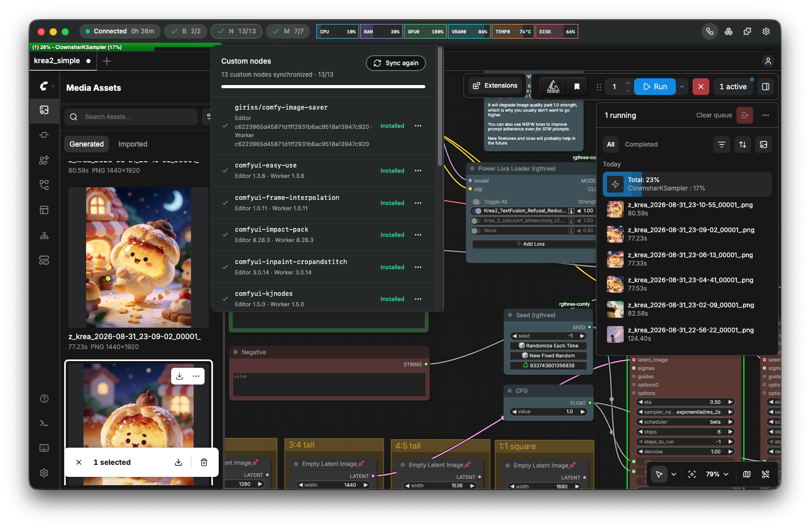

# Kastard

  

Kastard is a desktop app for editing ComfyUI workflows locally and running them on remote GPU workers.

  <a href="https://kastard.mintlify.site/en/getting-started">Getting Started</a> •
  <a href="https://kastard.mintlify.site">Docs</a> •
  <a href="https://discord.gg/Z9eUBVFncN">Discord</a>

  

## What you need

- A Mac with Apple silicon
- macOS 14 Sonoma or later

## Key features

- Local ComfyUI workflow editing
- Remote execution on RunPod and Vast.ai GPU Workers
- Worker deployment links for RunPod and Vast.ai
- ComfyUI Backend, model, and Custom Node synchronization
- Real-time Worker connection, synchronization, and workflow execution status
- Automatic transfer of local input files and display of execution results
- Automatic encrypted connections through an SSH tunnel

## Documentation

- [Getting Started](https://kastard.mintlify.site/en/getting-started)
- [Run a Worker with Docker](https://kastard.mintlify.site/en/run-worker-with-docker)
- [Edit and Run Workflows](https://kastard.mintlify.site/en/edit-and-run-workflows)
- [Add Models and Custom Nodes After Connecting](https://kastard.mintlify.site/en/add-models-and-custom-nodes)
